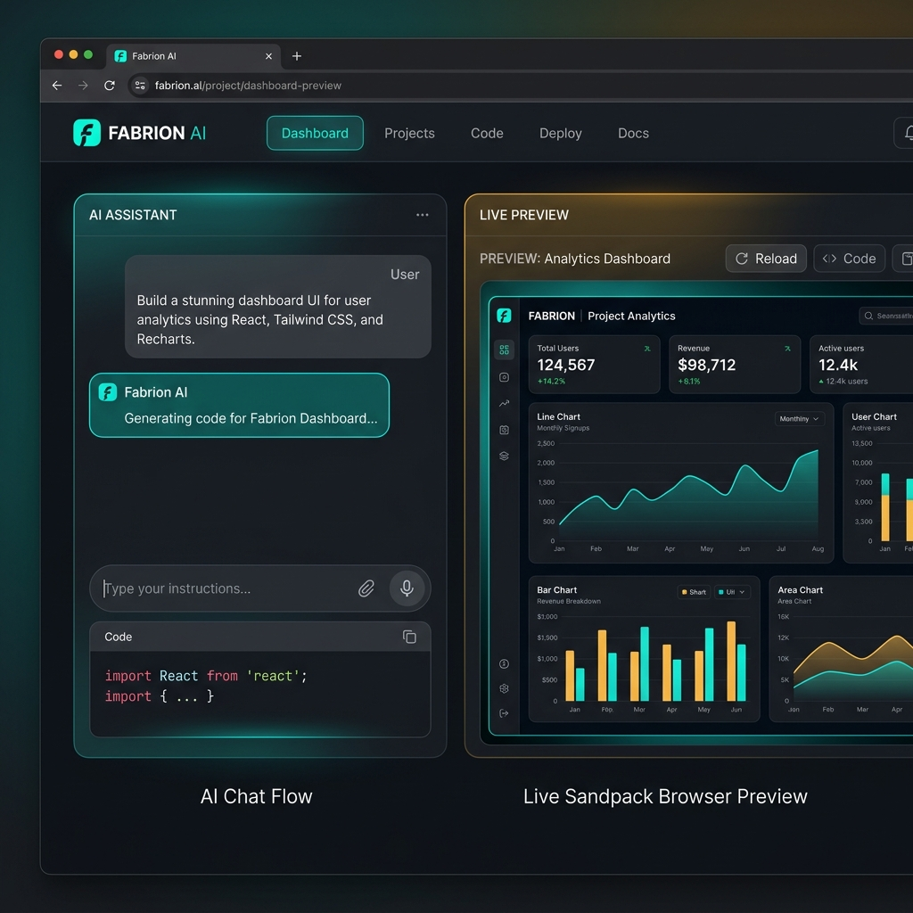
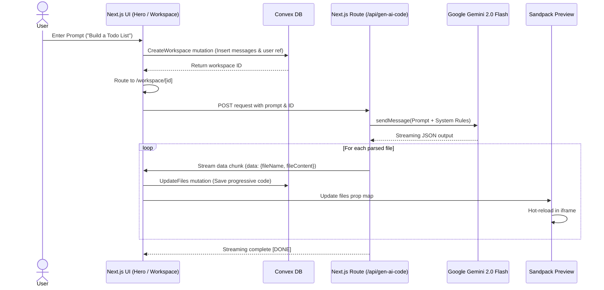

# 🌌 Fabrion — Next-Gen AI Web Application Sandbox Engine

```text
                                                       
  ███████╗  █████╗  ██████╗  ██████╗  ██╗  ██████╗  ███╗   ██╗
  ██╔════╝ ██╔══██╗ ██╔══██╗ ██╔══██╗ ██║ ██╔═══██╗ ████╗  ██║
  █████╗   ███████║ ██████╔╝ ██████╔╝ ██║ ██║   ██║ ██╔██╗ ██║
  ██╔══╝   ██╔══██║ ██╔══██╗ ██╔══██╗ ██║ ██║   ██║ ██║╚██╗██║
  ██║      ██║  ██║ ██████╔╝ ██║  ██║ ██║ ╚██████╔╝ ██║ ╚████║
  ╚═╝      ╚═╝  ╚═╝ ╚═════╝  ╚═╝  ╚═╝ ╚═╝  ╚═════╝  ╚═╝  ╚═══╝
                                                       
```

┌────────────────────────────────────────────────────────┐
│  FABRION: Next-Gen AI Web Application Sandbox Engine    │
├────────────────────────────────────────────────────────┤
│  AI Engine : Gemini 2.0 Flash    │ Database : Convex    │
│  Sandbox   : Sandpack React      │ Styling  : Tailwind  │
└────────────────────────────────────────────────────────┘

[](https://nextjs.org/)
[](https://convex.dev/)
[](https://deepmind.google/technologies/gemini/)
[](https://sandpack.codesandbox.io/)
[](https://tailwindcss.com/)
[](https://sentry.io/)

---

## 🌟 Overview

**Fabrion** is a web-based, AI-driven development environment that allows users to prompt, build, run, and preview React applications in real time directly from their browser. Inspired by platforms like Bolt.new and v0.dev, Fabrion utilizes Google Gemini's generative models to interpret natural language instructions and stream React codebases into an active client-side Sandpack preview container.



---

## 🚀 Key Features

*   **⚡ Streaming Code Generation:** AI prompts trigger real-time, streaming responses from Gemini 2.0 Flash, printing files incrementally onto the editor.
*   **🖥️ In-Browser Live Preview:** Integrated `@codesandbox/sandpack-react` running a live-compiled React (Vite) environment with CSS injection.
*   **☁️ Serverless State Sync:** High-performance real-time synchronization of chat logs, code files, and user workspaces powered by **Convex**.
*   **🔑 Custom API Key Middleware:** Support for both standard environment API keys and custom, user-provided Gemini API keys stored securely in Convex.
*   **🔐 Seamless OAuth Integration:** Sign-in workflow powered by Google OAuth mapped to custom schema definitions.
*   **👤 Integrated Profile & Session Navigation:** A cohesive navigation header rendered across both the home page and individual workspace dashboards, allowing users to toggle their developer profile settings and log out securely from any view (with instant home redirection).
*   **🛡️ Production-Grade Telemetry:** Error tracking and performance monitoring configured via **Sentry**.

---

## 📂 Repository Architecture

```text
/ (Workspace Root)
├── CODE_OF_CONDUCT.md
├── LICENSE
├── README.md                 <-- (You are here)
└── projectV1/                <-- Core Application Source
    ├── app/                  <-- Next.js Routing, Pages & API Hooks
    │   ├── (main)/workspace  <-- Sandbox layout routing matching workspace IDs
    │   ├── api/              <-- Stream endpoint connectors to Gemini API
    │   ├── provider.jsx      <-- NextThemes, Google OAuth, & Context Providers
    │   └── globals.css       <-- Tailwind styling definitions
    ├── components/
    │   ├── configs/          <-- AI Gemini client generation settings
    │   ├── custom/           <-- Core application views (ChatView, CodeView, Hero, etc.)
    │   └── ui/               <-- Reusable layout nodes (Dialog, Separator, Tooltip)
    ├── context/              <-- Context instances for message threads & user profiles
    ├── convex/               <-- Schema validations, mutations, & query functions
    ├── data/                 <-- Local constants, default templates, system prompts
    ├── public/               <-- Standard assets & images
    ├── package.json          <-- Client & tool dependencies
    └── next.config.mjs       <-- Config settings including redirect rewrites
```

---

## ⚙️ Environment Variables Setup

Create a `.env.local` file inside the `projectV1` directory containing the following:

```env
# Google Gemini API Config
NEXT_PUBLIC_GEMINI_API_KEY="your-gemini-api-key"

# Convex URL (obtained after running npx convex dev)
NEXT_PUBLIC_CONVEX_URL="https://your-project.convex.cloud"

# Google Auth API Config
NEXT_PUBLIC_GOOGLE_AUTH_CLIENT_KEY="your-google-oauth-client-id.apps.googleusercontent.com"
```

---

## 🏗️ Getting Started

### 1. Clone & Enter Directory
```bash
git clone <repository-url>
cd Fabrion/projectV1
```

### 2. Install Dependencies
```bash
npm install
```

### 3. Initialize Convex
To set up the serverless backend, run:
```bash
npx convex dev
```
*Note: This command will ask you to log in to Convex and create a new project. It will automatically generate `.env.local` values for your Convex URL.*

### 4. Run the Dev Server
In a separate terminal tab:
```bash
npm run dev
```
Open [http://localhost:3000](http://localhost:3000) to see the dashboard interface in action.

---

## 🧠 Architectural Flow



---

## 🛠️ Contribution Guidelines

1. **Keep CSS Modern:** Utilize Tailwind CSS classes for layouts. Avoid legacy inline styles.
2. **Handle API Robustness:** Always sanitize user API keys. If a user key fails, fall back gracefully to the default system key.
3. **Performance First:** Keep React components light, and ensure Sandpack dependency imports (`projectV1/data/Lookup.jsx`) are optimized for fast compile times.